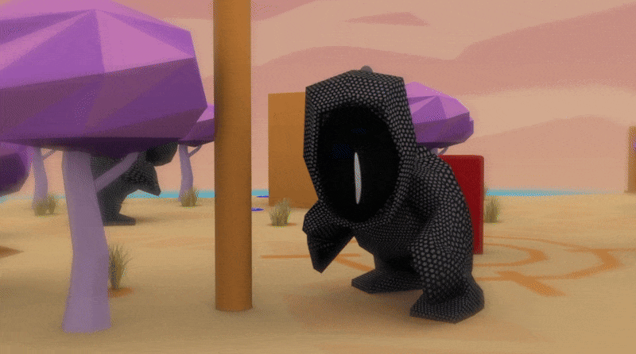

<p align="center"> 
  
</p>

[](https://javier-games.itch.io/kroneon)
[](https://leiva2017.wordpress.com/actividades/muestra-de-proyectos-leiva-2017/)

# Króneon

Embark on a thought-provoking puzzle-adventure as Li, who must save his beloved grandfather from unknown creatures. 
To succeed, solve puzzles by time traveling through the mysterious 'fridge', which allows you to experience the world 
from different perspectives.

# Development

Króneon was conceptualized and created of the [LEIVA](https://leiva.cenart.gob.mx/) program at the National Center of
Arts. LEIVA, the Interdisciplinary Laboratory for Experimentation and Innovation with Video Games and Interactive Art,
is a collaborative space that explores new narrative, aesthetic, and technological possibilities in gaming.

The game was [exhibited](https://leiva2017.wordpress.com/actividades/muestra-de-proyectos-leiva-2017/) from August 24 
to September 3, 2017, at the Manuel Felguérez Gallery, National Center of Arts, Mexico City.

<p align="center"> 
  
</p>

## Credits

- 3D Modeling and Levels: Fabián Martínez
- Graphic Design and Story: Rosalina Armendáriz
- 2D Animation and Video: Ana Laura Próspero
- Music and UI Programming: [Guillermo Basoco](https://github.com/GuillermoBasoco)
- Programming and Game Design: [Javier García](https://github.com/javier-games)

<p align="center"> 
  
</p>

# Features

## Challenging Puzzles

Solve intricate puzzles activating switches, and navigating through doors within a limited timeframe.

## Time Travel Mechanic

Each level has a limited number of time travels available. To initiate time travel, the player must wait for the time 
machine (represented as an old fridge) to charge. Once the machine is fully charged, the player's position is stored,
and any movements made afterward are recorded. By pressing the space button, the player can then create a clone that
repeats the recorded routine, helping them solve puzzles by collaborating with their past self.

## Paradox-Free Interaction

Strategically plan your moves, as Li cannot see his other selves without causing a paradox. To avoid this, characters 
can detect the presence of other characters in front of them, allowing you to navigate and solve puzzles without 
direct visual contact between clones.

<p align="center"> 
  
</p>

# Requirements

- [Unity 2017.1.1f1](https://unity.com/releases/editor/whats-new/2017.1.1#installs)

> This project was made using some assets from the official stores
> and are not included in this public repository. Please get the official assets in the links below.

- [SimplePoly World](https://assetstore.unity.com/packages/3d/environments/simplepoly-world-low-poly-assets-73353)
- [Bean Pole Font](https://fontmeme.com/fonts/bean-pole-font/)

# Project Installation

To set up and run the Króneon game project, follow these steps:

1. Open your terminal or command prompt.
2. Clone the repository using the following command:
    ```bash 
    git clone https://github.com/javier-games/poc-kroneon.git 
    ``` 
3. Open the project.
4. Select the `Main` scene.

# Game Installation

1. Download the installer for Mac or Windows from the [itch.io](https://javier-games.itch.io/kroneon) official site.
2. Once the download is complete, open the installer file.
3. Follow the on-screen instructions to install Króneon on your computer.
4. After installation is complete, launch the game.
5. Enjoy playing!

# License

This project is licensed under the GNU General Public License v3.0. See the [LICENSE](LICENSE.txt) file for details. 
